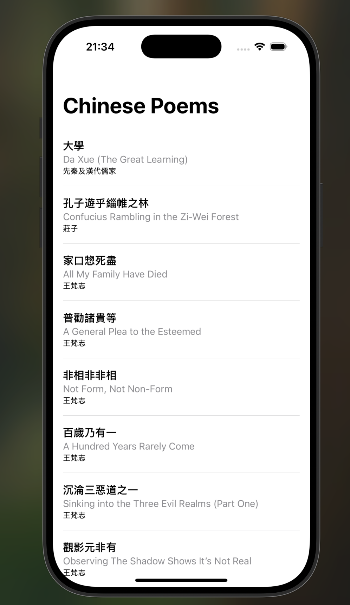

# Repository Contents

## File Structure
```
.
├── Assets.xcassets
│   ├── AccentColor.colorset
│   │   └── Contents.json
│   ├── AppIcon.appiconset
│   │   ├── Contents.json
│   │   └── Icon-1024.png
│   └── Contents.json
├── ChinesePoemsApp.swift
├── ContentView.swift
├── Preview Content
│   └── Preview Assets.xcassets
│       └── Contents.json
├── README.md
├── generate_docs.sh
├── hanzi.png
├── notes
│   └── TODO.md
├── pinyin.png
├── poem_authors
│   └── poem_authors.md
├── poem_page.png
├── poems.json
├── repository_contents.md
├── screenshot.png
├── text.json
└── yingwen.png

8 directories, 19 files
```

## File Contents

### ./ChinesePoemsApp.swift

```swift
//
//  ChinesePoemsApp.swift
//  ChinesePoems
//
//  Created by Carson Mulligan on 12/15/24.
//

import SwiftUI

@main
struct ChinesePoemsApp: App {
    var body: some Scene {
        WindowGroup {
            ContentView()
        }
    }
}
```

### ./ContentView.swift

```swift
//
//  ContentView.swift
//  ChinesePoems
//
//  Created by Carson Mulligan on 12/15/24.
//

import SwiftUI

// Dictionary entry model
struct DictionaryEntry: Codable {
    let pinyin: String
    let definition: String
    let pinyin_tone_lines: String
}

// Model for our poems
struct Poem: Identifiable, Codable {
    let id: String
    let title_chinese: String
    let title: String
    let author_chinese: String
    let author: String
    let content: String
    let translation_english: String
}

// Main content view
struct ContentView: View {
    @State private var poems: [Poem] = []
    @State private var showTranslation = false
    
    var body: some View {
        NavigationStack {
            ScrollView {
                LazyVStack(alignment: .leading) {
                    ForEach(poems) { poem in
                        NavigationLink(destination: PoemDetailView(poem: poem, showTranslation: $showTranslation)) {
                            VStack(alignment: .leading, spacing: 4) {
                                Text(poem.title_chinese)
                                    .font(.headline)
                                    .foregroundColor(.primary)
                                Text(poem.title)
                                    .font(.subheadline)
                                    .foregroundColor(.secondary)
                                Text(poem.author_chinese)
                                    .font(.caption)
                                    .foregroundColor(.primary)
                            }
                            .padding(.vertical, 8)
                        }
                        Divider()
                    }
                }
                .padding()
            }
            .navigationTitle("Chinese Poems")
        }
        .onAppear {
            loadPoems()
        }
    }
    
    private func loadPoems() {
        let bundle = Bundle.main
        if let path = bundle.path(forResource: "poems", ofType: "json") {
            do {
                let data = try Data(contentsOf: URL(fileURLWithPath: path))
                let decoder = JSONDecoder()
                let decodedData = try decoder.decode([String: Poem].self, from: data)
                poems = Array(decodedData.values).sorted { $0.title_chinese < $1.title_chinese }
            } catch {
                // Silently handle error
            }
        }
    }
}

// Detail view for individual poems
struct PoemDetailView: View {
    let poem: Poem
    @Binding var showTranslation: Bool
    @State private var showPinyin = false
    @State private var pinyinDictionary: [String: DictionaryEntry] = [:]
    
    var body: some View {
        ScrollView(.vertical, showsIndicators: false) {
            VStack(spacing: 0) {
                if showTranslation {
                    EnglishTextColumn(text: poem.translation_english)
                        .padding(.horizontal)
                } else {
                    ChineseTextColumn(text: poem.content, showPinyin: showPinyin, pinyinDictionary: pinyinDictionary)
                }
            }
            .padding(.vertical, 40)
        }
        .navigationBarTitleDisplayMode(.inline)
        .navigationTitle(showTranslation ? poem.title : poem.title_chinese)
        .toolbar {
            ToolbarItem(placement: .topBarLeading) {
                if !showTranslation {
                    Button(showPinyin ? "Hide Pinyin" : "Show Pinyin") {
                        showPinyin.toggle()
                    }
                }
            }
            ToolbarItem(placement: .topBarTrailing) {
                Button(showTranslation ? "Show Chinese" : "Show English") {
                    showTranslation.toggle()
                }
            }
        }
        .onAppear {
            loadPinyinDictionary()
        }
    }
    
    private func loadPinyinDictionary() {
        print("DEBUG Pinyin: Attempting to load dictionary")
        
        guard let url = Bundle.main.url(forResource: "chinese_to_pinyin_dictionary_with_tones", withExtension: "json") else {
            print("DEBUG Pinyin: Could not find dictionary file in bundle")
            // List all files in bundle for debugging
            if let resources = try? FileManager.default.contentsOfDirectory(atPath: Bundle.main.bundlePath) {
                print("DEBUG Pinyin: Files in bundle:")
                resources.forEach { print("DEBUG Pinyin: - \($0)") }
            }
            return
        }
        
        do {
            let data = try Data(contentsOf: url)
            print("DEBUG Pinyin: Successfully read data, size: \(data.count) bytes")
            pinyinDictionary = try JSONDecoder().decode([String: DictionaryEntry].self, from: data)
            print("DEBUG Pinyin: Successfully loaded dictionary with \(pinyinDictionary.count) entries")
            // Print a few sample entries
            let sampleKeys = Array(pinyinDictionary.keys.prefix(3))
            for key in sampleKeys {
                print("DEBUG Pinyin: Sample entry - \(key): \(pinyinDictionary[key]?.pinyin ?? "nil")")
            }
        } catch {
            print("DEBUG Pinyin: Error loading dictionary: \(error)")
            print("DEBUG Pinyin: Error details: \(error.localizedDescription)")
        }
    }
}

struct ChineseTextColumn: View {
    let text: String
    let showPinyin: Bool
    let pinyinDictionary: [String: DictionaryEntry]
    
    var body: some View {
        VStack(spacing: 20) {
            ForEach(Array(text.enumerated()), id: \.offset) { _, char in
                HStack(alignment: .center, spacing: 8) {
                    Text(String(char))
                        .font(.system(size: 28, weight: .medium))
                        .foregroundColor(.primary)
                    
                    if showPinyin {
                        let charStr = String(char)
                        if let entry = pinyinDictionary[charStr] {
                            Text(entry.pinyin_tone_lines)
                                .font(.system(size: 16))
                                .foregroundColor(.secondary)
                        }
                    }
                }
            }
        }
        .frame(maxWidth: .infinity)
        .padding(.horizontal)
    }
}

struct EnglishTextColumn: View {
    let text: String
    
    var body: some View {
        VStack(spacing: 12) {
            ForEach(text.split(separator: " ").enumerated().map { index, word in
                (index, String(word))
            }, id: \.0) { _, word in
                Text(word)
                    .font(.system(size: 18))
                    .foregroundColor(.primary)
                    .fixedSize()
            }
        }
        .frame(maxWidth: .infinity)
        .padding(.horizontal)
    }
}

#Preview {
    ContentView()
}
```

### ./README.md

```markdown



```

### ./generate_docs.sh

```
#!/bin/bash

# Create output file
output_file="repository_contents.md"

# Write header
echo "# Repository Contents" > $output_file
echo "" >> $output_file

# Generate tree structure
echo "## File Structure" >> $output_file
echo '```' >> $output_file
tree -I "node_modules|.git|*.xcodeproj|*.xcworkspace|*.framework|build|DerivedData|*dictionary*" . >> $output_file
echo '```' >> $output_file
echo "" >> $output_file

# Function to detect file type
get_file_type() {
    case "$1" in
        *.swift) echo "swift";;
        *.json) echo "json";;
        *.md) echo "markdown";;
        *.txt) echo "text";;
        *.h) echo "objectivec";;
        *.m) echo "objectivec";;
        *.plist) echo "xml";;
        *) echo "";;  # Return empty for unknown types
    esac
}

# Function to check if file is text
is_text_file() {
    file "$1" | grep -q "text"
}

# Add all file contents
echo "## File Contents" >> $output_file

# Find all files and sort them
find . -type f \
    -not -path '*/\.*' \
    -not -path '*/build/*' \
    -not -path '*/DerivedData/*' \
    -not -path '*.xcodeproj/*' \
    -not -path '*.xcworkspace/*' \
    -not -path '*.framework/*' \
    -not -name '*.png' \
    -not -name '*.jpg' \
    -not -name '*.jpeg' \
    -not -name '*.gif' \
    -not -name '*.pdf' \
    -not -name '*.zip' \
    -not -name '*dictionary*' \
    | sort | while read -r file; do
    
    # Skip the output file itself and dictionary files
    if [ "$file" = "./$output_file" ] || [[ "$file" == *"dictionary"* ]]; then
        continue
    fi
    
    # Only process text files
    if is_text_file "$file"; then
        echo "" >> $output_file
        echo "### $file" >> $output_file
        echo "" >> $output_file
        
        # Get file type for markdown formatting
        file_type=$(get_file_type "$file")
        
        if [ ! -z "$file_type" ]; then
            echo "\`\`\`$file_type" >> $output_file
        else
            echo "\`\`\`" >> $output_file
        fi
        
        cat "$file" >> $output_file
        echo "\`\`\`" >> $output_file
    fi
done

echo "Generated repository contents in $output_file" ```

### ./notes/TODO.md

```markdown
> (DONE)remove the debugging red text from the page 
> (DONE) make the english portion show up by itself when toggled 
> (DONE) consider adding in a dictionary so users can see pinyin

> remove red debug lines for periods and spaces 
> ship to main branch
> add more poems
> ship the damn thing to the app store


> consider adding in a save words function
> add in a read poem aloud function 
> consider adding in hanzi query so people can see it written 


```

### ./poem_authors/poem_authors.md

```markdown
盧仝 = https://ctext.org/datawiki.pl?if=en&res=648658

白居易 = https://ctext.org/datawiki.pl?if=en&res=85307

李賀 = https://ctext.org/datawiki.pl?if=en&res=844221

韓愈 = https://ctext.org/datawiki.pl?if=en&res=821445

張籍 = https://ctext.org/datawiki.pl?if=en&res=490993

王梵志 = https://ctext.org/wiki.pl?if=gb&res=730752

孟子 =https://ctext.org/mengzi/zhs

庄子 = https://ctext.org/zhuangzi/zhs```

### ./text.json

```json
{
    "promotional_text": "Ancient Chinese poetry meets modern design. Vertical reading, just like the ancients intended.",
    
    "description": "Simple. Clean. Classical Chinese poetry in its purest form.\n\nRead vertically, character by character, the way it was meant to be. Toggle between original Chinese and English translations with a tap. Need help with pronunciation? Pinyin's there when you want it.\n\nFeatures:\n• Classical poems from the greats\n• Vertical reading layout\n• One-tap English translations\n• Optional pinyin guides\n• Clean, distraction-free design\n\nNo frills, no fuss. Just you and centuries of Chinese wisdom.",
    
    "keywords": "chinese poetry,classical chinese,vertical reading,pinyin,poetry translation,chinese literature,chinese poems,learning chinese",
    
    "version": "1.0",
    
    "copyright": "© 2024 Carson Mulligan"
} ```

chinese_to_pinyin_dictionary_with_tones.json 
example of dictionary file:

....
  "㮚": {
    "pinyin": "li4",
    "definition": "old variant of 栗[li4]",
    "pinyin_tone_lines": "lì"
  },
  "㮸": {
    "pinyin": "song4",
    "definition": "variant of 送[song4]",
    "pinyin_tone_lines": "sòng"
  },
  "㯭": {
    "pinyin": "lu3",
    "definition": "variant of 櫓|橹[lu3]",
    "pinyin_tone_lines": "lǔ"
  },
....